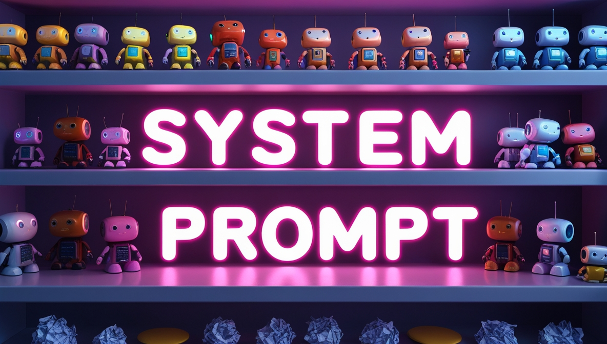

# System Prompts For System Prompt Writing And Editing

This repository contains a collection of system prompts designed to assist with creating, editing, and refining AI assistant configurations. Each file focuses on a specific aspect of prompt engineering, providing templates and instructions for different use cases.

> **Note:** These are specialized system prompts specifically designed for generating, editing, and refining other system prompts. They serve as meta-tools for prompt engineering.

## System Prompts

| Name | Description |
|------|-------------|
| [Batch Generator](./batch-generator.md) | Creates multiple system prompts in batch based on a set of requirements |
| [Depersonaliser](./depersonaliser.md) | Removes personal information and identifiers from system prompts |
| [Doctor](./doctor.md) | Diagnoses and fixes issues in existing system prompts |
| [Editor](./editor.md) | Provides comprehensive editing capabilities for refining system prompts |
| [Generator](./generator.md) | Creates structured system prompts with parameters from user descriptions |
| [Modernizer](./modernizer.md) | Updates older system prompts to leverage newer AI capabilities |
| [Pair Suggester](./pair-suggester.md) | Suggests complementary system prompts that work well together |
| [Prompt Forker](./prompt-forker.md) | Creates variations of existing system prompts for different use cases |
| [Prompt to Image](./prompt-to-image.md) | Generates image prompts that visually represent system prompt functionality |
| [QA Workflow](./qa-workflow.md) | Establishes quality assurance workflows for testing system prompts |
| [Remixer](./remixer.md) | Combines elements from multiple system prompts into new configurations |
| [Share Processor](./share-processor.md) | Processes and formats system prompts for sharing across platforms |

## Usage

Each markdown file contains a complete system prompt that can be copied directly into an AI assistant's configuration. To use these prompts:

1. Select the appropriate prompt file based on your needs
2. Copy the entire content of the file
3. Paste it into the system prompt field of your preferred AI assistant platform
4. Follow any specific instructions contained within the prompt

## Contributing

Feel free to contribute additional system prompts or improvements to existing ones by submitting pull requests.

## License

This repository is available for public use. Please provide attribution when using these prompts in your projects.
